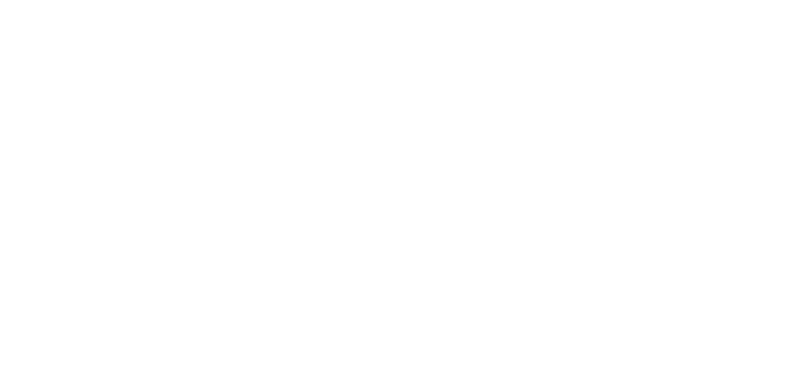

---
hide:
  - navigation
  - toc
  - path
---

  
  

    <h1 class="astro-title">
      
      Documentation
    </h1>
    
The FRC Robotics Framework

    
    

      <a href="getting-started/overview/" class="astro-btn-primary">
        Install MARS 
        <svg width="18" height="18" viewBox="0 0 24 24" fill="none" stroke="currentColor" stroke-width="2.5" stroke-linecap="round" stroke-linejoin="round"><path d="M21 15v4a2 2 0 0 1-2 2H5a2 2 0 0 1-2-2v-4"></path><polyline points="7 10 12 15 17 10"></polyline><line x1="12" y1="15" x2="12" y2="3"></line></svg>
      </a>
      <a href="getting-started/overview/" class="astro-btn-secondary">
        Learn about MARS features &rarr;
      </a>
    

    

      Powered by 
    

  

  

    

      
      
      
      
      
      

      

      

      

      

      
    

  

